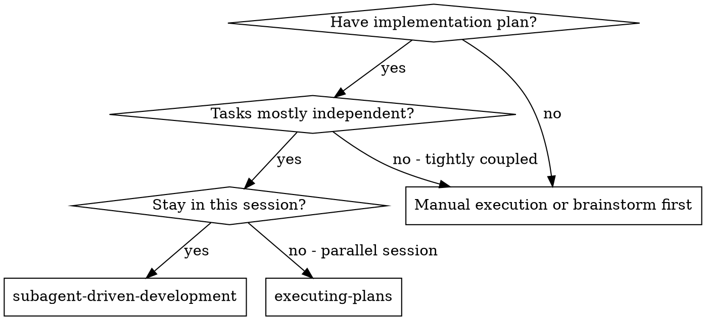
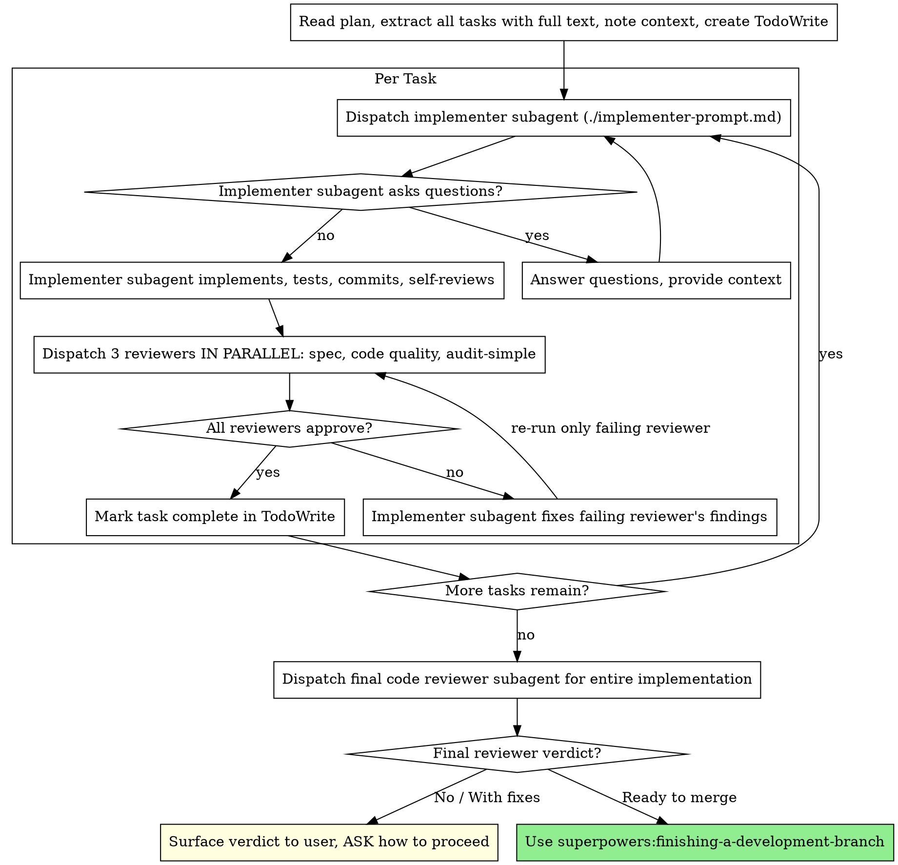

# Subagent-Driven Development

Execute plan by dispatching a fresh subagent per task, with **three reviewers in parallel** after each task (spec compliance, code quality, audit-simple) and a **final code review** before finishing — critical findings require user approval.

**Why subagents:** You delegate tasks to specialized agents with isolated context. By precisely crafting their instructions and context, you ensure they stay focused and succeed at their task. They should never inherit your session's context or history — you construct exactly what they need. This also preserves your own context for coordination work.

**Core principle:** Fresh subagent per task + parallel three-reviewer gate per task + final code review before finishing = high quality, fast iteration.

**Continuous execution:** Do not pause to check in with your human partner between tasks. Execute all tasks from the plan without stopping. The only reasons to stop are: BLOCKED status you cannot resolve, ambiguity that genuinely prevents progress, all tasks complete, or the final code reviewer surfaced critical issues that need the user's call. "Should I continue?" prompts and progress summaries waste their time — they asked you to execute the plan, so execute it.

## When to Use



**vs. Executing Plans (parallel session):**
- Same session (no context switch)
- Fresh subagent per task (no context pollution)
- Per-task gate runs three reviewers in parallel: spec compliance, code quality, audit-simple
- Final code review before finishing — critical findings require user approval
- Faster iteration (no human-in-loop between tasks)

## The Process



### Per-Task Reviewer Gate

After the implementer reports DONE, dispatch all three reviewers **in parallel** (single message with three Agent tool uses):

1. **Spec compliance reviewer** — uses `./spec-reviewer-prompt.md` (model: opus)
2. **Code quality reviewer** — uses `./code-quality-reviewer-prompt.md` (model: opus)
3. **Audit-simple reviewer** — uses `./audit-reviewer-prompt.md`, scoped to this task's commits (model: opus)

Each reviewer returns ✅ or ❌. The task is complete only when **all three** return ✅.

For each ❌, dispatch the implementer to fix that reviewer's findings, then re-dispatch **only** the reviewer that found issues. Do not re-run reviewers that already approved — this saves cost and avoids cascading revalidation.

### Final Code Review

After every task in the plan has passed its per-task gate, dispatch a final code reviewer subagent for the entire implementation. Use the `superpowers:requesting-code-review` template (`code-reviewer.md`) — this gives a holistic Strengths / Issues (Critical/Important/Minor) / Recommendations / **Ready to merge** verdict, which the per-task gates and audit-simple don't produce.

Final code reviewer model: `opus`.

1. Dispatch with BASE_SHA = branch base, HEAD_SHA = current HEAD.
2. **Verdict "Ready to merge: Yes" →** invoke `superpowers:finishing-a-development-branch`.
3. **Verdict "No" or "With fixes", or any Critical issues →** STOP. Surface the verdict and Critical/Important issues to the user verbatim and ASK how to proceed (fix now / track in a follow-up / stop). Do not silently proceed.

**Never** invoke `finishing-a-development-branch` while the final reviewer flagged Critical issues without explicit user approval to proceed.

## Model Selection

Use the least powerful model that can handle each role to conserve cost and increase speed.

**Reviewer subagents (spec compliance, code quality, audit-simple, final code reviewer):** always `model: "opus"` — reviewer signal quality compounds across the per-task and final gates, so the model is pinned regardless of task complexity.

**Mechanical implementation tasks** (isolated functions, clear specs, 1-2 files): use a fast, cheap model. Most implementation tasks are mechanical when the plan is well-specified.

**Integration and judgment tasks** (multi-file coordination, pattern matching, debugging): use a standard model.

**Architecture and design tasks**: use the most capable available model.

**Task complexity signals:**
- Touches 1-2 files with a complete spec → cheap model
- Touches multiple files with integration concerns → standard model
- Requires design judgment or broad codebase understanding → most capable model

## Handling Implementer Status

Implementer subagents report one of four statuses. Handle each appropriately:

**DONE:** Proceed to the per-task reviewer gate (dispatch all three reviewers in parallel).

**DONE_WITH_CONCERNS:** The implementer completed the work but flagged doubts. Read the concerns before proceeding. If the concerns are about correctness or scope, address them before review. If they're observations (e.g., "this file is getting large"), note them and proceed to review.

**NEEDS_CONTEXT:** The implementer needs information that wasn't provided. Provide the missing context and re-dispatch.

**BLOCKED:** The implementer cannot complete the task. Assess the blocker:
1. If it's a context problem, provide more context and re-dispatch with the same model
2. If the task requires more reasoning, re-dispatch with a more capable model
3. If the task is too large, break it into smaller pieces
4. If the plan itself is wrong, escalate to the human

**Never** ignore an escalation or force the same model to retry without changes. If the implementer said it's stuck, something needs to change.

## Prompt Templates

- `./implementer-prompt.md` - Dispatch implementer subagent
- `./spec-reviewer-prompt.md` - Dispatch spec compliance reviewer subagent (model: opus)
- `./code-quality-reviewer-prompt.md` - Dispatch code quality reviewer subagent (model: opus)
- `./audit-reviewer-prompt.md` - Dispatch per-task audit-simple reviewer subagent (model: opus)
- Final code reviewer uses `superpowers:requesting-code-review` template (`code-reviewer.md`) — model: opus

## Example Workflow

```
You: I'm using Subagent-Driven Development to execute this plan.

[Read plan file once: docs/superpowers/plans/feature-plan.md]
[Extract all 5 tasks with full text and context]
[Create TodoWrite with all tasks]

Task 1: Hook installation script

[Get Task 1 text and context (already extracted)]
[Dispatch implementation subagent with full task text + context]

Implementer: "Before I begin - should the hook be installed at user or system level?"

You: "User level (~/.config/superpowers/hooks/)"

Implementer: "Got it. Implementing now..."
[Later] Implementer:
  - Implemented install-hook command
  - Added tests, 5/5 passing
  - Self-review: Found I missed --force flag, added it
  - Committed

[Dispatch 3 reviewers IN PARALLEL — spec, code quality, audit-simple]
Spec reviewer:  ✅ Spec compliant - all requirements met, nothing extra
Code reviewer:  ✅ Strengths: Good test coverage, clean. Issues: None. Approved.
Audit reviewer: ✅ No critical issues

[Mark Task 1 complete]

Task 2: Recovery modes

[Get Task 2 text and context (already extracted)]
[Dispatch implementation subagent with full task text + context]

Implementer: [No questions, proceeds]
Implementer:
  - Added verify/repair modes
  - 8/8 tests passing
  - Self-review: All good
  - Committed

[Dispatch 3 reviewers IN PARALLEL]
Spec reviewer: ❌ Issues:
  - Missing: Progress reporting (spec says "report every 100 items")
  - Extra: Added --json flag (not requested)
Code reviewer: Strengths: Solid. Issues (Important): Magic number (100)
Audit reviewer: ✅ No critical issues

[Implementer fixes spec + code-quality issues]
Implementer: Removed --json flag, added progress reporting, extracted PROGRESS_INTERVAL constant

[Re-dispatch ONLY spec & code-quality reviewers — audit already approved]
Spec reviewer: ✅ Spec compliant now
Code reviewer: ✅ Approved

[Mark Task 2 complete]

...

[After all tasks]
[Dispatch final code-reviewer]
Final reviewer: All requirements met, ready to merge

Done!
```

If the final reviewer instead returns Critical issues or "Ready to merge: No / With fixes", surface the verdict and Critical/Important issues to the user and ASK how to proceed (fix now / track in a follow-up / stop) before invoking `finishing-a-development-branch`.

## Advantages

**vs. Manual execution:**
- Subagents follow TDD naturally
- Fresh context per task (no confusion)
- Parallel-safe (subagents don't interfere)
- Subagent can ask questions (before AND during work)

**vs. Executing Plans:**
- Same session (no handoff)
- Continuous progress (no waiting)
- Review checkpoints automatic
- Final code review with user approval gate on critical issues

**Efficiency gains:**
- No file reading overhead (controller provides full text)
- Controller curates exactly what context is needed
- Subagent gets complete information upfront
- Questions surfaced before work begins (not after)

**Quality gates:**
- Self-review catches issues before handoff
- Per-task gate runs three reviewers in parallel: spec compliance, code quality, audit-simple
- Final code review before finishing produces a holistic Strengths/Issues/Verdict
- Critical issues at the final review require explicit user approval — no silent ship

**Cost:**
- More subagent invocations (implementer + 3 parallel reviewers per task + final code reviewer)
- Reviewer model is pinned to opus
- Controller does more prep work (extracting all tasks upfront)
- Review loops add iterations
- But catches issues early (cheaper than debugging later)

## Red Flags

**Never:**
- Start implementation on main/master branch without explicit user consent
- Skip any of the three per-task reviewers (spec, code quality, audit-simple)
- Run the three reviewers sequentially when they can be dispatched in parallel
- Re-dispatch all three reviewers after fixing a single reviewer's finding (only re-run the failing one)
- Proceed with unfixed issues
- Dispatch multiple implementation subagents in parallel (conflicts)
- Make subagent read plan file (provide full text instead)
- Skip scene-setting context (subagent needs to understand where task fits)
- Ignore subagent questions (answer before letting them proceed)
- Accept "close enough" on any reviewer (any reviewer found issues = not done)
- Skip review loops (reviewer found issues = implementer fixes = review again)
- Let implementer self-review replace actual review (both are needed)
- Move to next task while any reviewer has open issues
- Skip the final code review before finishing-a-development-branch
- Invoke finishing-a-development-branch with unresolved Critical issues without explicit user approval
- Silently proceed when the final reviewer says "No" or "With fixes" — surface the verdict and ASK

**If subagent asks questions:**
- Answer clearly and completely
- Provide additional context if needed
- Don't rush them into implementation

**If a reviewer finds issues:**
- Implementer (same subagent or fresh dispatch) fixes them
- Re-dispatch only that reviewer
- Repeat until approved
- Don't skip the re-review

**If the final code reviewer flags Critical issues or returns "No / With fixes":**
- Surface verdict and Critical/Important issues to the user verbatim
- ASK how to proceed (fix now / follow-up ticket / stop)
- Do not invoke finishing-a-development-branch without explicit approval

**If subagent fails task:**
- Dispatch fix subagent with specific instructions
- Don't try to fix manually (context pollution)

## Integration

**Required workflow skills:**
- **superpowers:using-git-worktrees** - Ensures isolated workspace (creates one or verifies existing)
- **superpowers:writing-plans** - Creates the plan this skill executes
- **superpowers:requesting-code-review** - Code review template for the per-task code-quality reviewer and the final code reviewer
- **audit-simple** - Per-task critical-only audit gate (one of the three parallel reviewers)
- **superpowers:finishing-a-development-branch** - Complete development after all tasks (after the final code reviewer says Ready to merge, or user explicitly approves proceeding despite Critical issues)

**Subagents should use:**
- **superpowers:test-driven-development** - Subagents follow TDD for each task

**Alternative workflow:**
- **superpowers:executing-plans** - Use for parallel session instead of same-session execution
